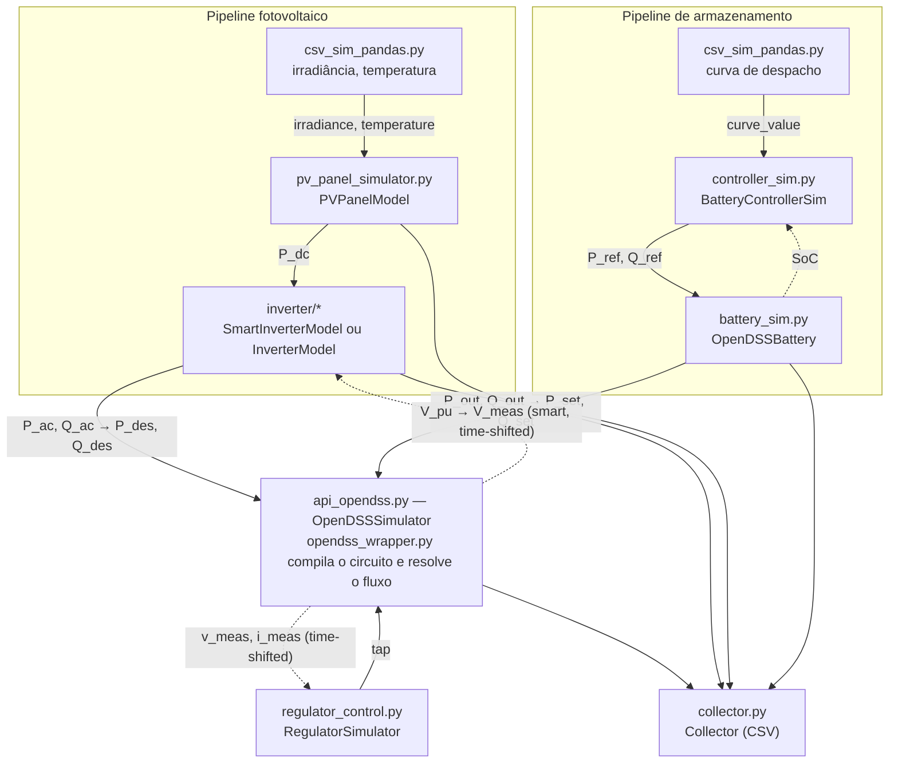

# Arquitetura do Projeto

## Visão geral

tsre-der-opentes é um sistema de **co-simulação** distribuída. Cada componente físico (rede elétrica, painel PV, inversor, bateria, regulador) é simulado por um módulo independente, e o framework **mosaik** coordena a troca de dados entre eles em passos de tempo discretos.

## Diagrama de componentes



Setas tracejadas indicam realimentação (`time_shifted=True`): o valor usado é o do passo anterior, para quebrar o ciclo causal entre a tensão medida e a potência que a afeta. Veja [Conceitos de Co-Simulação](co-simulation-concepts.md#conexoes-no-mosaik).

## Camadas do sistema

### 1. Modelos de domínio (lógica pura)

Módulos com a física e controle, sem dependência do mosaik. Testáveis isoladamente.

| Módulo | Classe | Responsabilidade |
|---|---|---|
| `inverter/smart_inverter.py` | `SmartInverterModel` | Conversão DC→AC, eficiência, cut-in/out, controle IEEE 1547 via OpenDER |
| `inverter/config.py` | `ControlConfig`, `VoltVarCurve`, ... | Configuração declarativa e validada do controle |
| `inverter/opender_factory.py` | — | Tradução para o `DERCommonFileFormat` do OpenDER |
| `inverter/inverter.py` | `InverterModel` | Modelo antigo, sem OpenDER (compatibilidade) |
| `battery/battery_model.py` | `OpenDSSBattery` | Estados de carga/descarga, SoC, limites de energia |
| `pv/pv_panel_simulator.py` | `PVPanelModel` | Irradiância × temperatura → potência DC |
| `controller/regulator_control.py` | `VR_Model` | Controle de tap com LDC e histerese |

### 2. Adaptadores mosaik (interface de simulação)

Cada adaptador implementa a API v3 do mosaik (`mosaik_api_v3.Simulator`) e expõe um `META` dict com `api_version`, `type` e `models`.

| Adaptador | Tipo | Modelo(s) |
|---|---|---|
| `opendss/api_opendss.py` | time-based | Grid, Load, Line, Bus, RegControl, Storage, PVSystem |
| `inverter/smart_inverter_simulator.py` | time-based | Inverter (com ou sem OpenDER) |
| `battery/battery_sim.py` | time-based | Battery |
| `controller/controller_sim.py` | time-based | Controller |
| `controller/regulator_control.py` | time-based | RegController |
| `pv/pv_panel_simulator.py` | time-based | PVPanel |
| `collector/collector.py` | **event-based** | Monitor |
| `collector/csv_sim_pandas.py` | **hybrid** | Data |

#### META derivada de um registro declarativo

Em `opendss/api_opendss.py` e em `inverter/smart_inverter_simulator.py`, a `META` não é escrita à mão: é gerada a partir de um registro declarativo (`opendss/element_specs.py::MODEL_SPECS`; `inverter/smart_inverter_simulator.py::INPUT_SPECS`/`OUTPUT_GETTERS`). O mesmo registro também alimenta o roteamento de entradas em `step()` e as leituras em `get_data()`.

**Por quê**: com `META`, `step()` e `get_data()` editados separadamente, nada impede que um atributo apareça em um sem existir nos outros dois — um cenário conecta um atributo que a `META` promete, mas que `get_data()` nunca produz, e o erro só aparece como um valor ausente em tempo de execução. Derivar os três do mesmo registro torna essa divergência estruturalmente impossível: adicionar um atributo significa adicionar uma entrada ao registro, não editar três funções e torcer para que concordem. `tests/test_element_specs.py` (`TestGeneratedMeta`, `TestMetaMatchesImplementation`) é a suíte que garante isso.

Os demais adaptadores (`battery_sim.py`, `pv_panel_simulator.py`, `controller_sim.py`, `regulator_control.py`) ainda declaram `META` como dict literal — é o padrão anterior, não um erro; adotar o registro declarativo nesses módulos é uma extensão possível, não uma correção pendente.

### 3. Wrapper OpenDSS

`opendss_wrapper.py` é a **única interface** com o motor OpenDSS. Todos os módulos que precisam interagir com o circuito passam por ele.

Responsabilidades:

- Compilar arquivos `.dss`
- Resolver fluxo de potência (snapshot)
- Ler e escrever tensões, correntes, potências
- Controlar elementos (tap, potência de PV/Storage)
- Detectar tipos de elementos no circuito

### 4. Cenários

Scripts autônomos em `scenarios/` que orquestram a simulação: definem `SIM_CONFIG`, criam entidades, conectam adaptadores e executam o mundo mosaik.

Cada cenário é um script independente — não é um módulo importável.

### 5. Ferramentas utilitárias

| Ferramenta | Módulo | Função |
|---|---|---|
| PVCreator | `util/pv_creator.py` | Gerar PVSystems + LoadShapes automaticamente |
| Topologia | `util/topologia.py` | Exportar grafo do circuito para JSON |
| TopologyBuilder | `opendss/topology_builder.py` | Construir grafo topológico a partir do OpenDSS |

## Fluxo de execução de um cenário

1. O cenário define `SIM_CONFIG` com os endereços dos simuladores
2. `mosaik.World(SIM_CONFIG)` é criado
3. Cada simulador é iniciado via `world.start("Chave", **params)`
4. Entidades são criadas (Grid, PVPanel, Inverter, Monitor, etc.)
5. Conexões são feitas entre atributos de entidades
6. `world.run(until=END_TIME)` executa a simulação
7. A cada passo, cada adaptador: recebe inputs → executa lógica → retorna outputs
8. O Collector escreve os resultados em CSV

## Modos de execução

### Local (Python)

Todos os adaptadores rodam como processos Python no mesmo host. `SIM_CONFIG` usa chaves `"python"`:

```python
SIM_CONFIG = {
    "DSS": {"python": "simulators.opendss.api_opendss:OpenDSSSimulator"},
}
```

### Docker (rede TCP)

Cada adaptador roda em um container Docker com `--remote 0.0.0.0:<porta>`. `SIM_CONFIG` usa chaves `"connect"`:

```python
SIM_CONFIG = {
    "DSS": {"connect": "localhost:5671"},
}
```

## Convenção de sinais

O OpenDSS retorna potência de geração com sinal **negativo**. O adaptador inverte os sinais na fronteira usando `extract_3phase_pq(sign=-1)`, para que os demais módulos trabalhem com valores positivos para geração.

Consulte [Convenção de Sinais](sign-convention.md) para detalhes.
