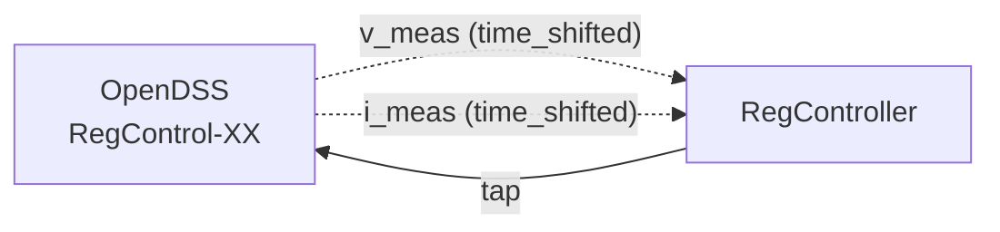

# Configurar Regulador de Tensão

## Visão geral

O regulador de tensão (tap changer) ajusta a posição de tap de um transformador para manter a tensão dentro de uma faixa aceitável. Este guia explica como configurar e usar o `VR_Model`.

## Quando usar

- Cenários com reguladores de tensão no circuito OpenDSS
- Controle de tap com compensação de queda de linha (LDC)
- Validação de estratégias de regulação

## Parâmetros do regulador

| Parâmetro | Tipo | Default | Descrição |
|---|---|---|---|
| `Vref` | `float` | 120 | Tensão de referência no secundário (V) |
| `db` | `float` | 2 | Largura da faixa morta (V) |
| `PT_Ratio` | `float` | 20 | Razão do transformador de potencial |
| `CT_Primary` | `float` | 700 | Corrente nominal do CT (A) |
| `LDC_R` | `float` | 0 | Resistência da compensação LDC (Ω) |
| `LDC_X` | `float` | 0 | Reatância da compensação LDC (Ω) |
| `Td_ctrl` | `float` | 30 | Atraso de controle (s) |
| `Td_tap` | `float` | 2 | Atraso entre taps (s) |
| `tap_max` | `int` | 16 | Tap máximo |
| `tap_min` | `int` | -16 | Tap mínimo |

## Cenário de referência

O cenário `opendss_scenario_34bus.py` é o único que utiliza o regulador:

```bash
uv run --no-sync python scenarios/opendss_scenario_34bus.py
```

Este cenário:

1. Descobre automaticamente os reguladores do circuito 34-bus
2. Cria uma entidade `RegController` para cada regulador
3. Conecta medições de tensão/corrente do OpenDSS ao controlador
4. Envia comandos de tap de volta ao OpenDSS

## Conexões de feedback



O `time_shifted=True` é essencial para evitar ciclos causais.

## Lógica de controle

1. Mede tensão no bus alvo
2. Aplica compensação LDC: `Vreg = |Vsec - Vdrop|`
3. Compara com `Vref ± db/2`:
   - Acima → Overvoltage → diminui tap
   - Abaixo → Undervoltage → aumenta tap
   - Dentro → Idle
4. Espera `Td_ctrl` segundos antes de agir
5. Espera `Td_tap` segundos entre mudanças de tap
