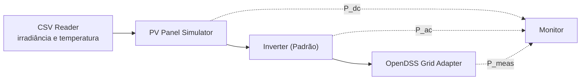

# Pipeline PV Local

Este tutorial explica a cadeia de simulação fotovoltaica (CSV → Painel PV → Inversor → OpenDSS) usando um cenário local.

## Objetivo

Entender como cada componente da cadeia PV interage e como configurar um cenário local com inversor padrão.

## Pré-requisitos

- Ambiente instalado ([Instalação](../getting-started/installation.md))
- Familiaridade com o [Primeira Simulação](../getting-started/first-simulation.md)

## O pipeline em seis etapas



As setas tracejadas são o monitoramento — cada componente conecta-se ao `Monitor` diretamente, não em cadeia através dos outros (confirmado na seção [Conexões mosaik](#conexoes-mosaik) abaixo).

### Etapa 1: Leitura de dados climáticos

O `CSV Reader` (`csv_sim_pandas.py`) lê um arquivo CSV com colunas de data/hora, irradiância e temperatura.

**Arquivo de exemplo**: `data/123Bus/ieee123_shape_pv_5min.csv`

```
Date,my_shape2_pv
2026-01-01 00:00:00,0.0
2026-01-01 00:05:00,0.0
...
2026-01-01 06:30:00,0.45
```

**Parâmetros do init**:

```python
csv.start("CSV",
    sim_start="2026-01-01 00:00:00",
    datafile="data/123Bus/ieee123_shape_pv_5min.csv",
    date_format="%Y-%m-%d %H:%M:%S",
    continuous=True  # interpola entre timestamps
)
```

### Etapa 2: Modelo do painel PV

O `PVPanelSim` converte irradiância e temperatura em potência DC:

```python
P_dc = max(0, P_mpp × irradiance_base × irradiance × pt_factor)
```

Onde `pt_factor` é interpolado da curva de correção de temperatura.

**Exemplo de criação** (via cenário):

```python
pv_panel = pvsim.PVPanel(
    P_mpp=5.0,            # 5 kW pico
    irradiance_base=1000, # W/m²
    pt_curve_x=[25, 50],  # °C
    pt_curve_y=[1.0, 0.92]
)
```

### Etapa 3: Inversor padrão

O `InverterSim` converte potência DC em AC com eficiência e limitações:

1. Verifica cut-in/cut-out
2. Interpola curva de eficiência: `P_ac = P_dc × η`
3. Aplica limitação kVA com prioridade (ativa ou reativa)

**Exemplo de criação**:

```python
inv = inverter.Inverter(
    kVA=5.0,
    priority="Active",
    eff_curve_x=[0, 20, 40, 60, 80, 100],
    eff_curve_y=[0.85, 0.90, 0.93, 0.95, 0.96, 0.97],
    pct_cutin=5.0,
    pct_cutout=95.0
)
```

### Etapa 4: OpenDSS Grid

O adaptador OpenDSS recebe `P_des` e `Q_des` do inversor e os aplica ao PVSystem correspondente no circuito.

### Etapa 5: Resolução do fluxo

A cada passo, o OpenDSS resolve o fluxo de potência e retorna tensões e correntes para todas as barras e linhas.

### Etapa 6: Coleta de dados

O `Monitor` grava todos os sinais em um arquivo CSV com timestamps.

## Exemplo completo: cenário 123-bus local

O cenário `opendss_scenario_123bus_pv.py` implementa este pipeline para o caso IEEE 123-bus:

```bash
uv run --no-sync python scenarios/opendss_scenario_123bus_pv.py
```

**Parâmetros**:

| Parâmetro | Valor |
|---|---|
| Step size | 300s (5 min) |
| Número de passos | 288 (24 horas) |
| Circuito | `run_ieee123_cosim_pv_5min.dss` |
| PVSystem | 1 (1000 kVA, barra 97) |
| Inversor | Padrão, 1000 kVA |

**Arquivo de saída**: `output/result_run_ieee123_cosim_pv_5min.csv`

## Conexões mosaik

```python
# Irradiância e temperatura → PV Panel
world.connect(csv_irr, pv_panel, ("my_shape2_pv", "irradiance"))
world.connect(csv_temp, pv_panel, ("temperature", "temperature"))

# PV Panel → Inversor
world.connect(pv_panel, inverter, ("P_dc", "P_dc"))

# Inversor → OpenDSS
world.connect(inverter, dss_grid, ("P_ac", "P_des"))
world.connect(inverter, dss_grid, ("Q_ac", "Q_des"))

# Monitoramento
world.connect(pv_panel, monitor, ("P_dc", "PVPanel-P_dc"))
world.connect(inverter, monitor, ("P_ac", "Inverter-P_ac"))
world.connect(dss_grid, monitor, ("P_meas", "DSS-PVSystem-P_meas"))
```

## Próximos passos

- [Tutorial: Co-Simulação Docker](docker-co-simulation.md) — executar o mesmo pipeline via Docker
- [Tutorial: Inversor Inteligente](smart-inverter-scenario.md) — adicionar controle Volt-Var
